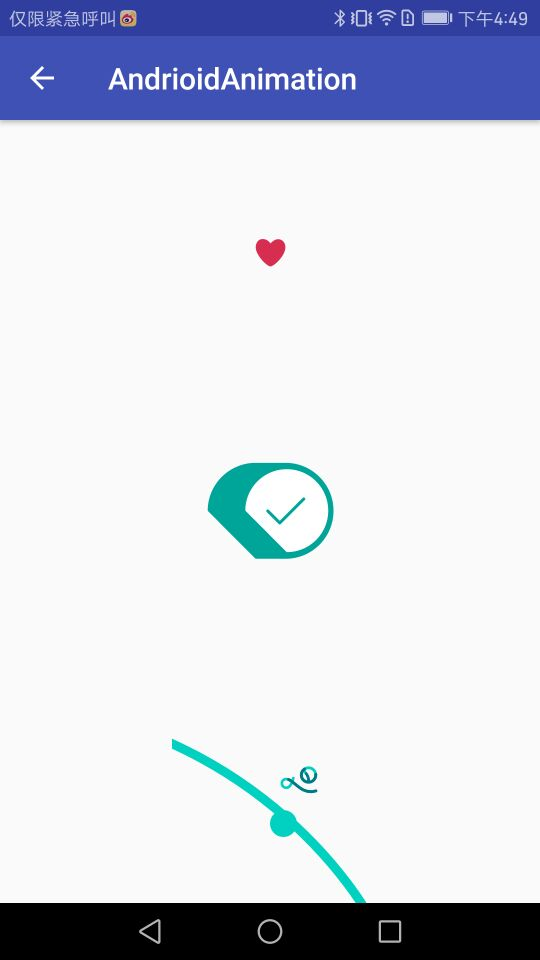

# AndroidAnimation

## 1.Ae的json动画的引入
* 导入动画的jar包：`compile 'com.airbnb.android:lottie:1.5.2'`
* Android的工程下边创建`assets->ae-json->`放入动画的.json文件
* xml加入`<com.airbnb.lottie.LottieAnimationView`，加入动画json
* activity中写入，控制动画的默认值，以及动画动的状态

